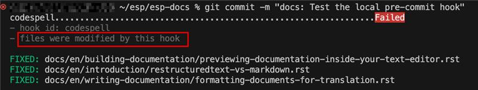
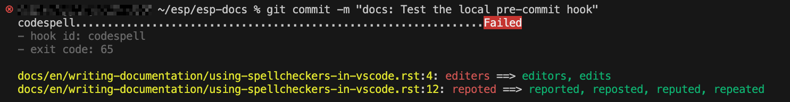

Configuring ``codespell`` in GitLab Repositories
================================================

This guide explains how to integrate `codespell <https://github.com/codespell-project/codespell>`_, a tool that detects common misspellings in source code, into a GitLab repository.

Two main usage scenarios are covered:

1.  **Local pre-commit hooks**

    ``codespell`` runs automatically when you attempt a Git commit, scanning staged changes for spelling errors.

2.  **CI/CD pipeline enforcement**

    ``codespell`` runs in GitLab CI as a job. If spelling errors are found, the job fails and contributors must fix issues locally before resubmitting.

In both cases, a shared configuration file ``.codespellrc`` ensures consistent behavior.

**Example:**

.. code-block:: ini

    [codespell]
    skip = build,*.drawio,*.svg,*.pdf
    ignore-words-list = laf,OT
    write-changes = true

- ``skip``: Specifies directories or file extensions to ignore (e.g., build outputs, diagrams).
- ``ignore-words-list``: Defines project-specific terms that should not be flagged (e.g., ``laf``, ``OT``).  
- ``write-changes``: Lets ``codespell`` automatically apply suggested fixes. If omitted, ``codespell`` runs in dry-run mode and only reports issues.

Using ``codespell`` as a Git Pre-Commit Hook (Local)
----------------------------------------------------

This method prevents spelling errors from being committed.

Steps
~~~~~

1.  Install ``pre-commit``.
   
    ``pre-commit`` is a framework that manages Git hooks. Install it with:

    .. code-block:: bash

        pip install pre-commit

2.  Activate the pre-commit hook in your repository.
   
    Go to your local repository and enable hooks with:

    .. code-block:: bash

        pre-commit install

3.  Modify ``.pre-commit-config.yaml``.

    Add ``codespell`` configuration:

    .. code-block:: yaml

        repos:
          - repo: https://github.com/codespell-project/codespell
            rev: v2.4.1 #latest release version
            hooks:
              - id: codespell
                args: [--config=.codespellrc]

    - ``repo``: Location of the codespell hook repository.  
    - ``rev``: The version of codespell to use. It is recommended to use **v2.4.1** to remain consistent with other repositories.
    - ``id``: Selects the codespell hook.  
    - ``args``: Passes additional arguments, here explicitly pointing to ``.codespellrc``.

Expected Behavior of the Local ``pre-commit`` Hook for ``codespell``
--------------------------------------------------------------------

When the local ``pre-commit`` hook for ``codespell`` runs, it scans only the files that have been modified. During the check, ``codespell`` automatically fixes typos when it is confident about the correct replacement.

    Automatic Correction by ``codespell``

If there are multiple possible corrections, ``codespell`` does not modify the files directly. Instead, it provides suggestions in the terminal output for you to review. For example, messages in the following screenshot show that ``codespell`` has found two potential typos, "editers" and "repoted", in lines 4 and 12 respectively. However, it is uncertain which correction to apply, so it displays the possible alternatives in green highlights for you to review and adopt.  # codespell:ignore (intentional typos for demonstration)

    Suggested Corrections from ``codespell``

Implement ``codespell`` in GitLab CI/CD
---------------------------------------

To ensure spelling checks are enforced for all contributions, you can integrate ``codespell`` directly into the GitLab CI/CD pipeline. When configured, each Merge Request pipeline can trigger a codespell job that scans **only the modified files**. If spelling errors are found, the job fails, and the contributor must fix the typos locally before pushing the corrected commit.

You can add ``codespell`` to your CI/CD process by either modifying ``.gitlab-ci.yml`` or, if ``pre-commit`` is already integrated (usually in ``.gitlab/ci/pre_commit.yml``), simply updating ``.pre-commit-config.yaml`` without changing any CI files.

1.  If you use ``.gitlab-ci.yml`` to manage all your jobs. Take the following code as an example:

    .. code-block:: yaml

        codespell_check:
          stage: check
          image: $ESP_DOCS_ENV_IMAGE
          extends:
            - .before_script_minimal
          rules:
            - if: $CI_PIPELINE_SOURCE == "merge_request_event"
          before_script:
            - pip install codespell
            - git fetch origin $CI_MERGE_REQUEST_TARGET_BRANCH_NAME --depth=1
            - git fetch origin $CI_COMMIT_REF_NAME --depth=1
            - export MODIFIED_FILES="$(git diff --name-only origin/$CI_MERGE_REQUEST_TARGET_BRANCH_NAME..origin/$CI_COMMIT_REF_NAME)"
          script:
            - |
              if [ -n "$MODIFIED_FILES" ]; then
                echo "Running codespell on changed files:"
                echo "$MODIFIED_FILES"
                codespell --config .codespellrc $MODIFIED_FILES
              else
                echo "No modified files to check with codespell."
              fi

    - ``stage``: Specifies the stage of the pipeline where this job belongs. The stage can be **check** or **pre-check** as defined earlier in the ``yml`` file.
    - ``image``: Specifies the Docker image used for running jobs. This should match the image already configured in your repository.
    - ``extends``: Inherits configuration from a predefined template, e.g., ``.before_script_minimal``. This reduces repetition and ensures consistent initialization across jobs.
    - ``rules``: Defines conditions for when the job should run. For example, using ``if: $CI_PIPELINE_SOURCE == "merge_request_event"`` ensures the job only runs in pipelines triggered by a Merge Request, and not for regular branch pushes or scheduled pipelines.
    - ``before_script``:

      - Installs ``codespell`` into the job environment.
      - Fetches the diff range between target and source branches.  
      - Collects the list of modified files for spell checking.

    - ``script``: Runs ``codespell`` on modified files only. If spelling errors are detected, the job fails.

2.  If your project runs unified pre-commit jobs in the CI pipeline, adding a separate ``codespell_check`` job in ``.gitlab-ci.yml`` is unnecessary. The CI pipeline simply uses the same ``.pre-commit-config.yaml`` file, ensuring that the checks performed in CI are identical to those on local machines.

How to Run Unified Pre-Commit Jobs in GitLab CI/CD
~~~~~~~~~~~~~~~~~~~~~~~~~~~~~~~~~~~~~~~~~~~~~~~~~~

Running unified pre-commit jobs in GitLab CI/CD is recommended because it allows you to easily add or update hooks in the future with minimal changes. Follow these steps to set it up:

Steps
^^^^^

1.  Include the ``.gitlab/ci/pre_commit.yml`` file in your root ``.gitlab-ci.yml`` configuration.

    **Example:**

    .. code-block:: yaml

        include:
          - '.gitlab/ci/pre_commit.yml'

    .. note::

        If your ``.gitlab-ci.yml`` file does not yet define any global workflow rules, please add the following configuration:

        .. code-block:: yaml

            workflow:
              rules:
                - if: $CI_PIPELINE_SOURCE == "merge_request_event" # Run pipelines only for merge requests
                - when: always # Fallback rule to always run if no other rules match

2.  Create the ``.gitlab/ci/pre_commit.yml`` file to include the following job definition:

    .. code-block:: yaml

        .check_pre_commit_template:
          stage: check  # or "pre-check", depending on your pipeline structure
          image: $ESP_DOCS_ENV_IMAGE  # Use the same image as other jobs in your repository
          extends:
            - .before_script_minimal  # Optional: reuse an existing minimal setup if available
          rules:
            - if: $CI_PIPELINE_SOURCE == "merge_request_event"  # Run this job only for merge request pipelines. 
          script:
            - pip install pre-commit
            - git fetch origin $CI_MERGE_REQUEST_TARGET_BRANCH_NAME --depth=1  # Fetch target branch latest commit
            - git fetch origin $CI_COMMIT_REF_NAME --depth=1  # Fetch source branch latest commit
            - |
              echo "Target branch: $CI_MERGE_REQUEST_TARGET_BRANCH_NAME"
              echo "Source branch: $CI_COMMIT_REF_NAME"

              MODIFIED_FILES=$(git diff --name-only origin/$CI_MERGE_REQUEST_TARGET_BRANCH_NAME..origin/$CI_COMMIT_REF_NAME)
              echo "Modified files to check:"
              echo "$MODIFIED_FILES"

              if [ -n "$MODIFIED_FILES" ]; then
                  CI=true pre-commit run --files $MODIFIED_FILES
              else
                  echo "No modified files to check."
              fi

        check_pre_commit:
          extends:
            - .check_pre_commit_template  # All configured pre-commit hooks will run under this job

    .. note::

        If your repository includes **submodules**, make sure to fetch them in the pre-commit job to ensure all files are available for scanning. 

        In this case, add the following configuration under ``.check_pre_commit_template``:

        .. code-block:: yaml

            variables:
              GIT_STRATEGY: fetch
              SUBMODULES_TO_FETCH: "all"
            script:
              - fetch_submodules  # Usually defined in ``utils.sh`` to fetch submodules
              # If 'fetch_submodules' is not available, you can alternatively use:
              # 'git submodule update --init --recursive'

3.  Modify the ``.pre-commit-config.yaml`` file to add the expected hook.

    **Example:**

    .. code-block:: yaml

        repos:
          - repo: https://github.com/codespell-project/codespell
            rev: v2.4.1
            hooks:
              - id: codespell
                args: [--config=.codespellrc]

4.  (Optional) Move any other custom jobs under the "check" or "pre_check" stages from ``gitlab-ci.yml`` to ``.gitlab/ci/pre_commit.yml`` if they cannot be defined in the "repos" format in ``.pre-commit-config.yaml``.

    **Example:**

    .. code-block:: yaml

        check_setup:
          stage: check
          image: $ESP_DOCS_ENV_IMAGE
          extends:
            - .before_script_minimal
          script:
            - pip install .

After completing these steps, your CI pipeline will automatically run all pre-commit hooks on the files modified in each Merge Request.

For a more detailed example, refer to `.gitlab-ci.yml <https://gitlab.espressif.cn:6688/espressif/esp-idf/-/blob/master/.gitlab-ci.yml?ref_type=heads>`__ in the ESP-IDF repository.

Summary
-------

- **Local pre-commit hook**: Prevents contributors from committing misspelled files.  
- **CI/CD pipeline check**: Enforces centralized spelling checks in CI pipelines. 
- **Unified config**: ``.codespellrc`` guarantees consistent behavior across environments.  

Combining both approaches ensures consistent spelling and improves documentation quality.

Potential Risks of ``codespell``
~~~~~~~~~~~~~~~~~~~~~~~~~~~~~~~~

The way ``codespell`` works is by using a dictionary of common misspellings and their correct forms. During checks, it scans files for words in this dictionary and suggests corrections. This means that ``codespell`` is **not a comprehensive spell checker** – it only detects typos that exist in its dictionary, and may miss other spelling mistakes.

To catch more typos in a smarter way, it is strongly recommended to enable a spell checker in your IDE or editor. For instance, you can :doc:`Use Spellcheckers in VS Code </writing-documentation/using-spellcheckers-in-vscode>`, which flags spelling mistakes instantly as you type.
