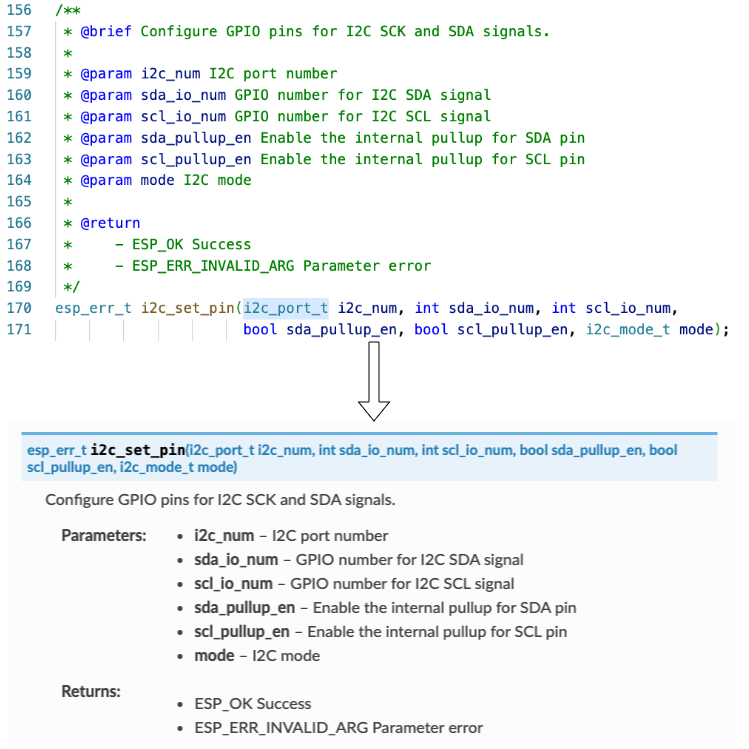
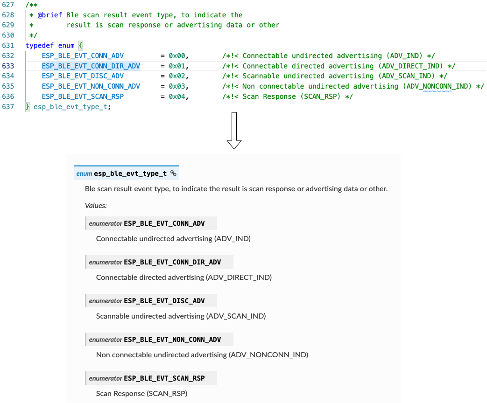
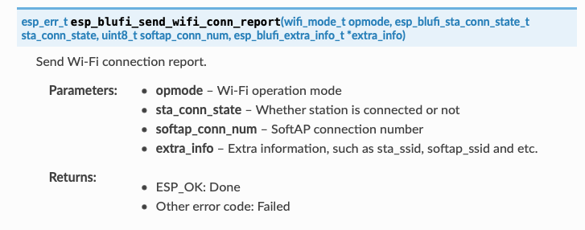

Formatting and Generating API Descriptions
==========================================

When you are documenting an API, there are some guidelines to follow, as demonstrated in :doc:`Writing API Descriptions <./writing-api-documentation>`. Preparing such documentation could be tedious.

To simplify this process, ESP-Docs provides the :project_file:`run_doxygen.py <src/esp_docs/esp_extensions/run_doxygen.py>` extension, which generates API descriptions from header files during documentation build. This extension allows for automatic updates whenever code changes occur.

This document will cover the following topics:

- `Syntax and formatting rules to document API in header files <Document API in Header Files>`_
    - `Comment Blocks`_
    - `In-Body Comments`_
    - `Target-Specific Information`_
    - `Style`_
- `How to generate the API descriptions and include them in rst files <Generate and Include API Descriptions>`_

Document API in Header Files
----------------------------

This section covers the formatting rules for API descriptions, so that the :project_file:`run_doxygen.py <src/esp_docs/esp_extensions/run_doxygen.py>` extension knows which descriptions should be extracted from header files.

Comment Blocks
^^^^^^^^^^^^^^

Comment blocks are used when documenting ``functions``. Such comment blocks start with ``/**``, and end with ``*/``. Other lines within comment blocks should be marked with ``*`` at the beginning:

.. code-block::

    /**
    * @brief A brief explanation for this function. It is mandatory.
    *        If the explanation cannot fit into one line, start the second line with indentation and a * at the beginning.
    *
    *        To break a line, break it twice (add an empty line in between), just like how you do in rst files.
    *
    * @param [parameter_1's_name] [meaning.]
    * @param [parameter_2's_name] [meaning.]
    *
    * @return
    *     - [response_1]: meaning.
    *     - [response_2]: meaning.
    */
    [function_type] [function_name](parameter_1_type parameter_1, parameter_2_type parameter_2);

    Rendered Result - Comment Blocks (Click to enlarge)

``@brief``, ``@param``, and ``@return`` form the basic structure for API descriptions. ``@param`` and ``@return`` can be skipped if a function does not have parameters or return any response.

If the function might return different responses, use a **bullet list** to document the responses under ``@return``.

Comment blocks have some additional features, which can make the formatting of API descriptions fancier:

- Use [in], [out], [in, out] to document the direction of parameters:

    .. code-block::

        *
        * @param[in] [parameter_1's_name] [meaning.]
        * @param[out] [parameter_2's_name] [meaning.]
        *

- Add notes, warnings, or attentions after ``@note``, ``@warning``, or ``@attention`` respectively:

    .. code-block::

        *
        * @note
        *    1. This is a numbered note. It is optional. Pay attention to the indentation.
        *    2. You can replace @note with @warning and @attention. The formatting rules are the same.
        *
        * @warning If there is only one warning, the warning can be placed in the same line with @warning.
        *

- Add code snippets enclosed by ``@code{c}`` and ``@endcode``:

    .. code-block::

        *
        * @code{c}
        * // Example of using nvs_get_i32:
        * int32_t max_buffer_size = 4096; // default value
        * esp_err_t err = nvs_get_i32(my_handle, "max_buffer_size", &max_buffer_size);
        * assert(err == ESP_OK || err == ESP_ERR_NVS_NOT_FOUND);
        * // if ESP_ERR_NVS_NOT_FOUND was returned, max_buffer_size will still
        * // have its default value.
        * @endcode
        *

- Group similar functions by enclosing them with ``/**@{*/`` and ``/**@}*/``:

    .. code-block::
        :emphasize-lines: 2,15

        /**@{*/
        /**
        * @brief      Set int8_t value for given key.
        *
        *
        * @param[in]  value   The value to set.
        *
        * @return
        *             - ESP_OK.
        *             - ESP_FAIL.
        */
        esp_err_t nvs_set_i8 (int8_t value);

        /**
        * @brief      Set uint16_t value for given key.
        *
        * This function is the same as \c nvs_set_i8 except for the data type.
        */
        esp_err_t nvs_set_u16 (uint16_t value);
        /**@}*/

- Use Markdown Syntax:

    .. code-block::

        *
        * @brief   Returns a random number inside a range.
        *          
        *          See [ESP32 Technical Reference Manual](https://www.espressif.com/sites/default/files/documentation/esp32_technical_reference_manual_en.pdf).
        *

In-Body Comments
^^^^^^^^^^^^^^^^

In-body comments are used when documenting a ``macro``, a ``typedef``, and members of a ``struct``, ``enum``, etc. Such in-body comments start with ``/*!<``, and end with ``*/``.

.. code-block::

    typedef struct {
        type member_1; /*!< Explanation for structure member_1. */
        type member_2; /*!< Explanation for structure member_2. */
        type member_3; /*!< Explanation for structure member_3. */
    } structure_name

Optionally, comment blocks can be used together with in-body comments when you provide overall descriptions for a ``struct``, ``enum``, etc.

.. code-block::
    :emphasize-lines: 1,2,3

    /**
    * @brief A brief explanation for this structure.
    */
    typedef struct {
        type member_1; /*!< Explanation for structure member_1. */
        type member_2; /*!< Explanation for structure member_2. */
        type member_3; /*!< Explanation for structure member_3. */
    } structure_name

    Rendered Result - In-Body Comments with Comment Blocks (Click to enlarge)

You may skip repetitive macros, enumerations, or other code by enclosing them within ``/** @cond */`` and ``/** @endcond */``, so that they will not show in the generated API descriptions:

.. code-block::

    /** @cond */
    typedef struct esp_flash_t esp_flash_t;
    /** @endcond */

Target-Specific Information
^^^^^^^^^^^^^^^^^^^^^^^^^^^

ESP-Docs introduces several functionalities to deal with target-specific contents (see :doc:`writing-for-multiple-targets`), but such functionalities are not supported for API descriptions generated from header files.

For target-specific information, it is preferable to use ``@note`` to clarify the applicable targets.

Use ``@note`` for a target-specific function:

.. code-block::
    :emphasize-lines: 3

    /**
    * @brief Enable RX PDM mode.
    * @note  ESP32-C3: Not applicable, because it doesn't support RX PDM mode.
    *
    * @param hw Peripheral I2S hardware instance address.
    * @param pdm_enable Set true to RX enable PDM mode (ignored).
    */
    static inline void i2s_ll_rx_enable_pdm(i2s_dev_t *hw, bool pdm_enable)

Use ``@note`` for a target-specific ``struct``:

.. code-block::
    :emphasize-lines: 4

    /**
    * @brief ADC digital controller (DMA mode) output data format.
    *        Used to analyze the acquired ADC (DMA) data.
    * @note  ESP32: Only `type1` is valid. ADC2 does not support DMA mode.
    */
    typedef struct {
        union {
            struct {
                uint16_t data:     12;  /*!<ADC real output data info. Resolution: 12 bit. */
                uint16_t channel:   4;  /*!<ADC channel index info. */
            } type1;                    /*!<ADC type1. */
            struct {
                uint16_t data:     11;  /*!<ADC real output data info Resolution: 11 bit. */
                uint16_t channel:   4;  /*!<ADC channel index info. For ESP32-S2:
                                            If (channel < `ADC_CHANNEL_MAX`), The data is valid.
                                            If (channel > `ADC_CHANNEL_MAX`), The data is invalid. */
                uint16_t unit:      1;  /*!<ADC unit index info. 0: ADC1; 1: ADC2.  */
            } type2;                    /*!<When the configured output format is 11 bit.*/
            uint16_t val;               /*!<Raw data value. */
        };
    } adc_digi_output_data_t;

Alternatively, you can use if statements (``#if`` and ``#endif`` directives in C language) together with macros defined in ``*_caps.h`` header files as shown in the following examples.

.. note::

    Please note that some developers tend to read header files directly instead of API documentation. If statements would make header files hard to read, so they are less recommended.

Use an if statement to mark a target-specific function:

.. code-block::
    :emphasize-lines: 1,17

    #if SOC_I2C_SUPPORT_SLAVE
    /**
    * @brief Write bytes to internal ringbuffer of the I2C slave data. When the TX fifo empty, the ISR will
    *        fill the hardware FIFO with the internal ringbuffer's data.
    *        @note This function shall only be called in I2C slave mode.
    *
    * @param i2c_num I2C port number.
    * @param data Bytes to write into internal buffer.
    * @param size Size, in bytes, of `data` buffer.
    * @param ticks_to_wait Maximum ticks to wait.
    *
    * @return
    *     - ESP_FAIL (-1): Parameter error.
    *     - Other (>=0): The number of data bytes pushed to the I2C slave buffer.
    */
    int i2c_slave_write_buffer(i2c_port_t i2c_num, const uint8_t *data, int size, TickType_t ticks_to_wait);
    #endif // SOC_I2C_SUPPORT_SLAVE

Use an if statement to mark a target-specific ``enum``:

.. code-block::
    :emphasize-lines: 6,7,8

    /**
    * @brief I2C port number, can be `I2C_NUM_0` ~ (`I2C_NUM_MAX` - 1).
    */
    typedef enum {
        I2C_NUM_0 = 0, /*!< I2C port 0. */
    #if SOC_I2C_NUM >= 2
        I2C_NUM_1, /*!< I2C port 1. */
    #endif
        I2C_NUM_MAX, /*!< Maximum I2C ports. */
    } i2c_port_t;

Style
^^^^^

When preparing the API descriptions, follow the style below for consistency:

- The maximum line length is 120 characters for better code readability, as described in `Espressif IoT Development Framework Style Guide <https://docs.espressif.com/projects/esp-idf/en/v5.0.2/esp32/contribute/style-guide.html#vertical-space>`_
- If descriptions in combination with code are more than 120 characters, manually break lines, or consider if the descriptions better fit in the main text (namely the ``.rst`` files)
- Capitalize the first word of every sentence segment or sentence
- Use a period ``.`` at the end of:
    * Complete sentences
    * Sentence fragments
    * Bulleted or numbered list items
- Use **bullet points** if there are 2 or more returned values
- Use ``:`` between a returned value and its meaning
- Between parameters and parameter meanings, do not add any punctuation marks such as ``-`` and ``:``

The example below shows how to follow above style after ``>>>``:

.. code-block::
  :linenos:

    /**
    *
    * @brief           This function is called to send wifi connection report         >>> Should add a ending period "." for complete sentences 
    * @param opmode :  Wi-Fi opmode.                                                  >>> Should delete the colon ":" between parameter's name and perameters' meaning
    * @param sta_conn_state     station is already in connection or not.              >>> Should be capitalized
    * @param softap_conn_num    Softap connection number.
    * @param extra_info         Extra information, such as sta_ssid, softap_ssid and etc.
    *
    * @return          ESP_OK - Success, other - Failed                               >>> Values should be listed using bullet points, and "-" should be changed to ":"
    *
    */
    esp_err_t esp_blufi_send_wifi_conn_report(wifi_mode_t opmode, esp_blufi_sta_conn_state_t sta_conn_state, uint8_t softap_conn_num, esp_blufi_extra_info_t *extra_info);

Above examples can be updated as follows in line with the rules (note that the returned error codes and their descriptions in line 10 can be more specific):

.. code-block::
  :linenos:
  :emphasize-lines: 3,10

    /**
    *
    * @brief Send Wi-Fi connection report.
    * @param opmode Wi-Fi operation mode.
    * @param sta_conn_state Whether station is connected or not.
    * @param softap_conn_num SoftAP connection number.
    * @param extra_info Extra information, such as sta_ssid, softap_ssid and etc.
    *
    * @return
    *      - ESP_OK: Done.
    *      - Other error code: Failed.
    *
    */
    esp_err_t esp_blufi_send_wifi_conn_report(wifi_mode_t opmode, esp_blufi_sta_conn_state_t sta_conn_state, uint8_t softap_conn_num, esp_blufi_extra_info_t *extra_info);

Generate and Include API Descriptions
-------------------------------------

``Doxyfile`` is the must-have Doxygen configuration file for automatic API generation. All header files used to generate API should be included in ``Doxyfile``. For example, please refer to the Doxyfile of `ESP-IDF <https://github.com/espressif/esp-idf/tree/master/docs/doxygen>`_.

.. note::

    Target-specific header files may be placed in a separate ``Doxyfile``. For example, `Doxyfile_esp32 <https://github.com/espressif/esp-idf/tree/master/docs/doxygen>`__ is provided to generate ESP32-specific API descriptions in ESP-IDF.

ESP-Docs integrates API generation into the process of building documentation. To be specific, when you run the command to build documentation (see :doc:`../building-documentation/building-documentation-locally`), :project_file:`run_doxygen.py <src/esp_docs/esp_extensions/run_doxygen.py>` generates ``.inc`` files from input header files defined in ``Doxyfile`` according to configuration, and places the output files in ``_build/$(language)/$(target)/inc`` directory.

To include the generated ``.inc`` files into ``.rst`` files, use the ``include-build-file::`` directive defined in :project_file:`include_build_file.py <src/esp_docs/esp_extensions/include_build_file.py>`.

.. code-block::

    API Reference
    -------------

    .. include-build-file:: inc/i2c.inc

Linking to Functions, Enumerations, etc
------------------------------------------------

To link to a function, enumeration, and other structure types described in API descriptions, please refer to :ref:`link-api-member`.

Example
-------

For reference, you may navigate to the :example:`doxygen` folder, and check the header files stored in the ``src/api`` subfolder.

To see the API descriptions in HTML, please run ``build_example.sh``.
