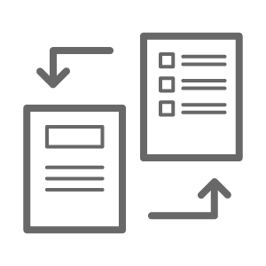

Tables
======

Tables can present complex information in an understandable way. With reStructuredText syntax, you can create tables in the following formats:

- `Simple Table`_
- `Grid Table`_
- `List Table`_ 👍👍👍
- `CSV Table`_

This document covers the syntax for all table formats and their pros and cons, so that you can choose the best fit for your use scenario. For more detailed instructions, please refer to `reStructuredText Directives > Tables <https://docutils.sourceforge.io/docs/ref/rst/directives.html#tables>`_.

Simple Table
------------

Simple tables are preceded and ended with a sequence of ``=`` to indicate columns.

Texts in the same column should be aligned with ``=`` on the left, and not extend beyond ``=`` on the right.

Simple tables supports:

- **Column span**: Cells in multiple columns (except last row) can be merged by adding a sequence of ``-``
- **Table notes**: Manually numbered footnote ``[1]_`` and autonumbered footnote ``[#]``
- **Insert pictures**

.. code-block::

    .. table::
      :align: center

      ==================================   ============================
      ESP-Docs 用户指南
      -----------------------------------------------------------------
      ==================================   ============================
      |write-doc|                          |build-doc|
      Writing Documentation [1]_           Building Documentation [#]_
      Covers ESP-Docs supported syntax     介绍如何预览、构建文档
      ==================================   ============================

    .. |write-doc| image:: ../../_static/writing-documentation.png
                :height: 100px
                :width: 100px
    .. |build-doc| image:: ../../_static/building-documentation.png
                :height: 100px
                :width: 100px

    .. [1] This is a manually numbered table note. Note that it generates links from notes back to the table.
    .. [#] This is an autonumbered table note. It generates no backlinks and continues numbering from the previous note.

The above table would be rendered as:

.. table::
  :align: center

  ==================================   ============================
  ESP-Docs 用户指南
  -----------------------------------------------------------------
  ==================================   ============================
  |write-doc|                          |build-doc|
  Writing Documentation [1]_           Building Documentation [#]_
  Covers ESP-Docs supported syntax     介绍如何预览、构建文档
  ==================================   ============================

.. [1] This is a manually numbered table note. Note that it generates links from notes back to the table.
.. [#] This is an autonumbered table note. It generates no backlinks and continues numbering from the previous note.

Grid Table
----------

Grid tables are named after its grid structure formed by delimiters ``+``, ``-``, and ``|``.

Grid tables support:

- **Column span**
- **Row span**
- **Table notes**
- **Bullet Lists**
- **Insert pictures** (For example, see :doc:`../index`)

If there are Chinese characters, the vertical bars ``|`` can hardly be aligned to form a grid.

.. code-block::
    :emphasize-lines: 2

    .. table::
      :align: center

    +----------+----------------------------------------+--------------------------+
    | 芯片     | 描述                                   | Ambient Temperature [#]_ |
    |          |                                        +-------------+------------+
    |          |                                        | Min (°C)    | Max (°C)   |
    +==========+========================================+=============+============+
    | ESP32-C3 | ESP32-C3 is a single-core, 32-bit,     | -40         | 105        |
    |          | RISC-V-based MCU with 400 KB of SRAM,  |             |            |
    |          | which is capable of running at 160 MHz.|             |            |
    +----------+----------------------------------------+-------------+------------+
    | ESP32-S3 | ESP32-S3 is a dual-core XTensa LX7 MCU,| -40         | 105        |
    |          | capable of running at 240 MHz.         |             |            |
    +----------+----------------------------------------+-------------+------------+

    .. [#] This is an autonumbered table note. Note that the automatic numbering continues from the previous table note.

The above table would be rendered as:

.. table::
  :align: center

  +----------+----------------------------------------+--------------------------+
  | 芯片     | 描述                                   | Ambient Temperature [#]_ |
  |          |                                        +-------------+------------+
  |          |                                        | Min (°C)    | Max (°C)   |
  +==========+========================================+=============+============+
  | ESP32-C3 | ESP32-C3 is a single-core, 32-bit,     | -40         | 105        |
  |          | RISC-V-based MCU with 400 KB of SRAM,  |             |            |
  |          | which is capable of running at 160 MHz.|             |            |
  +----------+----------------------------------------+-------------+------------+
  | ESP32-S3 | ESP32-S3 is a dual-core Xtensa LX7 MCU,| -40         | 105        |
  |          | capable of running at 240 MHz.         |             |            |
  +----------+----------------------------------------+-------------+------------+

.. [#] This is an autonumbered table note. Note that the automatic numbering continues from the previous table note.

To facilitate the generation of grid tables, you may use tools such as `Tables Generator <http://www.tablesgenerator.com/text_tables>`_.

List Table
----------

List tables are formed of two-level lists, where the first level ``*`` represents rows, and the second level ``-`` represents columns.

The number of columns must be consistent. Empty table cells should still by marked by ``-``, even if there is no content.

List tables support:

- **Adjustable column width**
- **Table notes**
- **Bullet Lists**
- **Insert pictures**

.. code-block::
    :emphasize-lines: 10

    .. list-table::
        :header-rows: 1
        :widths: 40 60
        :align: center

        * - Field
          - Value (Byte)
        * - Type (Least Significant Bit)
          - 1
        * - Frame Control (Frag)
          -
        * - 序列号
          - 1
        * - 数据长度
          - 1
        * - Data
          - * Total Content Length: 2
            * Content: ${Data Length} - 2
        * - CheckSum (Most Significant Bit) [#]_
          - 2

    .. [#] This is an autonumbered table note. Note that the automatic numbering continues from the previous table note.

The above table would be rendered as:

.. list-table::
   :header-rows: 1
   :widths: 40 60
   :align: center

   * - Field
     - Value (Byte)
   * - Type (Least Significant Bit)
     - 1
   * - Frame Control (Frag)
     -
   * - 序列号
     - 1
   * - 数据长度
     - 1
   * - Data
     - * Total Content Length: 2
       * Content: ${Data Length} - 2
   * - CheckSum (Most Significant Bit) [#]_
     - 2

.. [#] This is an autonumbered table note. Note that the automatic numbering continues from the previous table note.

CSV Table
---------

CSV (comma-separated values) tables might be the choice if you want to include CSV data into your documentation. The CSV data may be:

- placed in a separate CSV file
- an integral part of the document

As for formatting, CSV tables only support adjustable column width.

- Example of integrating a separate CSV file:

  .. code-block::

    .. csv-table:: Table Title
      :file: CSV file path and name
      :widths: 30, 70
      :align: center
      :header-rows: 1

- Example of integrating CSV data as an integral part of the document:

  .. code-block::

    .. csv-table:: Ordering Information
      :header: "订购代码", "Flash Size"
      :widths: 50, 50
      :align: center

      ESP32-C3,N/A
      ESP32-C3FN4,"4 MB"
      ESP32-C3FH4,"4 MB"

  The above table would be rendered as:

  .. csv-table:: Ordering Information
    :header: "订购代码", "Flash Size"
    :widths: 50, 50
    :align: center

    ESP32-C3,N/A
    ESP32-C3FN4,"4 MB"
    ESP32-C3FH4,"4 MB"

  .. note::

    Text with spaces in between should be enclosed by quotation marks, such as ``"4 MB"``.

Comparison
----------

To summarize:

- 👍👍👍 List tables are ideal because they achieve a balance between easy maintenance and advanced formatting features.
- Simple tables are good choices when table cells do not contain long sentences.
- Grid tables provide more formatting options, but they are the most difficult to maintain.
- CSV tables are convenient to present simple data, but not friendly to text with spaces.

.. list-table::
   :header-rows: 1
   :widths: 40 15 15 15 15

   * -
     - Simple Table
     - Grid Table
     - List Table
     - CSV Table
   * - What you see is what you get
     - ✅
     - ✅
     -
     -
   * - Easy to maintain
     - ✅
     -
     - ✅
     -
   * - Friendly to Chinese characters
     - ✅
     -
     - ✅
     - ✅
   * - Friendly to long text
     -
     - ✅
     - ✅
     -
   * - Adjustable table width
     -
     -
     - ✅
     - ✅
   * - Row span
     -
     - ✅
     -
     -
   * - Column span
     - ✅
     - ✅
     -
     -
   * - Bullet points
     -
     - ✅
     - ✅
     -

Still No Good Fit?
------------------

If the above table formats cannot meet your needs, consider adding new table extensions. For example, to use a list table for its easy maintenance, but with column span and row span features, you may refer to to the `flat-table <https://return42.github.io/linuxdoc/linuxdoc-howto/table-markup.html#flat-table>`_ directive.
