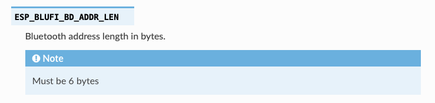
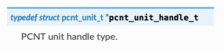
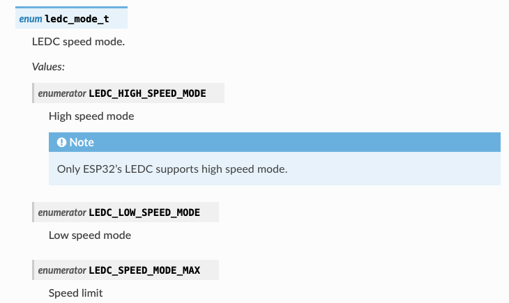
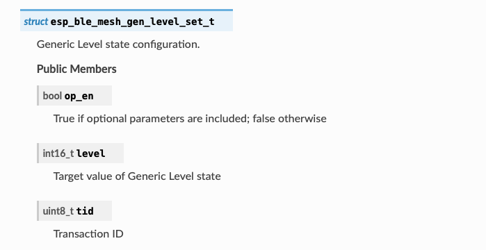
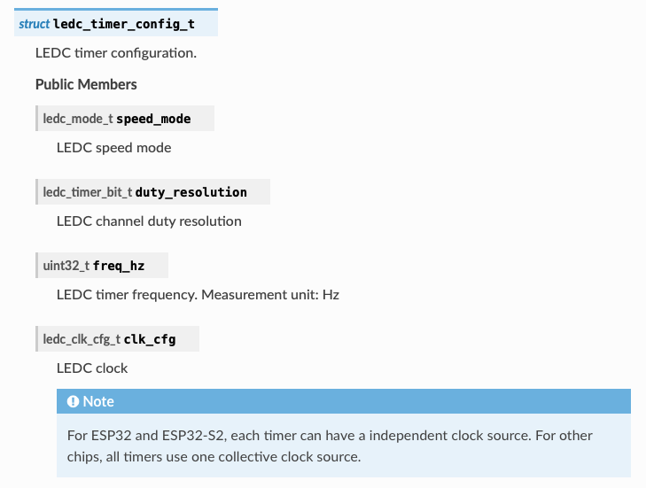
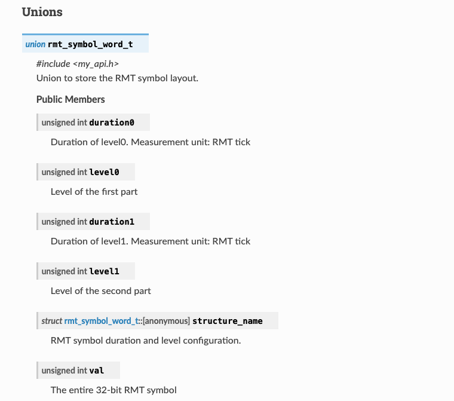
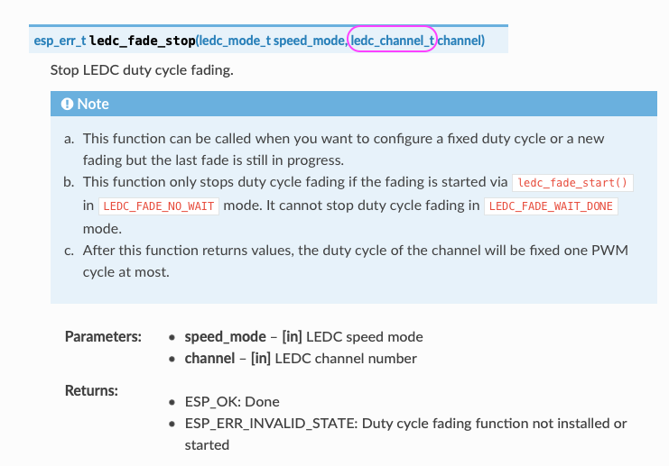

Writing API Description
=======================

The API descriptions contain all the information required to work with the API, with details about every function, structure, enumeration, and other elements used in the API. To help you write informative API descriptions in a consistent style, this document provides guidelines on what to write with practical examples.

.. contents::
  :local:
  :depth: 2

For details about formatting API documentation in header files, please refer to :doc:`./api-documentation`.

Document Conventions
--------------------

This document uses the conventions shown below to indicate types of patterns:

.. list-table::
   :header-rows: 1
   :widths: 35 20 45
   :align: center

   * - Pattern
     - Example
     - Identifies
   * - Descriptions enclosed in quotation marks ""
     - "Measurement unit: ..."
     - A fixed sentence pattern for describing measurement unit
   * - Directives indicated by the @ character
     - @brief
     - Tags used to define the formatting of the descriptions

Macro
-----

Macros are used to define reusable values or code snippets, such as a clock frequency, Wi-Fi's SSID, default configurations, etc.

Macro descriptions should include:

- @brief **A brief description of the macro**
    + Use concise sentence fragments if possible
    + Example: *@brief The number of CPU cores.*
- @note **Target-specific information, or anything that needs emphasis**
    + Example: *@note This macro is only for ESP32.*

Example 1: `ESP_BLUFI_BD_ADDR_LEN <https://docs.espressif.com/projects/esp-idf/en/v5.0.2/esp32/api-reference/bluetooth/esp_blufi.html#c.ESP_BLUFI_BD_ADDR_LEN>`_

.. code-block::
    
    /**
    * @brief Bluetooth address length in bytes.
    *
    * @note Must be 6 bytes.
    */
    #define ESP_BLUFI_BD_ADDR_LEN     6

The above code will be rendered as:

Example 2: `ESP_NETIF_INHERENT_DEFAULT_OPENTHREAD <https://docs.espressif.com/projects/esp-idf/en/v5.0.2/esp32/api-reference/network/esp_openthread.html#c.ESP_NETIF_INHERENT_DEFAULT_OPENTHREAD>`_

.. code-block::

    /**
    * @brief  Default configuration of OT ESP-NETIF.
    */
    #define ESP_NETIF_INHERENT_DEFAULT_OPENTHREAD() \
        {   \
            .flags = 0, \
            ESP_COMPILER_DESIGNATED_INIT_AGGREGATE_TYPE_EMPTY(mac) \
            ESP_COMPILER_DESIGNATED_INIT_AGGREGATE_TYPE_EMPTY(ip_info) \
            .get_ip_event = 0,    \
            .lost_ip_event = 0,   \
            .if_key = "OT_DEF",  \
            .if_desc = "openthread",    \
            .route_prio = 15      \
    };

The above code will be rendered as:

Type Definition
---------------

Type definitions are used to create a type alias or define a new type.

Type definition descriptions should include:

- @brief **A brief description of the typedef**
    + Use concise sentence fragments if possible
    + Example: *@brief Event handler type.*

.. note::

  When a type definition is used for function pointers or other similar cases, please refer to the corresponding guidelines for ``function``, etc.

Example: `pcnt_unit_handle_t <https://docs.espressif.com/projects/esp-idf/en/v5.1.2/esp32c6/api-reference/peripherals/pcnt.html#_CPPv418pcnt_unit_handle_t>`_

.. code-block::

    /**
    * @brief PCNT unit handle type.
    */
    typedef struct pcnt_unit_t *pcnt_unit_handle_t;

The above code will be rendered as:

Enumeration
-----------

Enumerations allow you to define a set of named values (or enumerators) as something textual and meaningful.

Enumeration descriptions should include:

- @brief **An overall description of the enumeration**
    + Use concise sentence fragments if possible
    + Example: *@brief Clock sources.*
- **Meanings of each enumerator**
    + Use concise sentence fragments or sentences
    + Example: *The duty resolution is 13 bits.*
- @note **Target-specific information, prerequisites to configure a structure member, or anything that needs emphasis**
    + Example: *@note The number of channels is different across chips.*

Example: `ledc_mode_t <https://docs.espressif.com/projects/esp-idf/en/v5.0.2/esp32/api-reference/peripherals/ledc.html#_CPPv411ledc_mode_t>`_

.. code-block::

    /**
    * @brief LEDC speed mode.
    */
    typedef enum {
        LEDC_HIGH_SPEED_MODE = 0, /*!< High speed mode. */
                                  /*!< @note Only ESP32's LEDC supports high speed mode. */
        LEDC_LOW_SPEED_MODE,      /*!< Low speed mode. */
        LEDC_SPEED_MODE_MAX,      /*!< Speed limit. */
    } ledc_mode_t;

The above code will be rendered as:

Structure
---------

Structures provide a way to group several related data elements (or members) into one place, so that functions can easily use them as parameters. Members in a structure may be of different data types such as ``int``, ``char``, and ``bool``.

Structure descriptions should include:

- @brief **An overall description of the structure**
    + Use concise sentence fragments if possible
    + Example: *@brief ESP-NOW rate configuration.*
- A list of structure members
    * **Description of each structure member**
        + Use concise sentence fragments if possible
        + If the structure member is a ``bool``, use the format "True if ...; false otherwise. "
        + Example: *True if the timer interrupts are shared; false otherwise.*
    * **"Measurement unit: ..."**, if any
    * @note **Target-specific information, prerequisites to configure a structure member, or anything that needs emphasis**

Example 1: `struct esp_ble_mesh_gen_level_set_t <https://docs.espressif.com/projects/esp-idf/en/v5.0.2/esp32c3/api-reference/bluetooth/esp-ble-mesh.html?#_CPPv428esp_ble_mesh_gen_level_set_t>`_

.. code-block::

    /**
    * @brief Generic Level state configuration.
    */
    typedef struct {
        bool    op_en;      /*!< True if optional parameters are included; false otherwise. */
        int16_t level;      /*!< Target value of Generic Level state. */
        uint8_t tid;        /*!< Transaction ID. */
    } esp_ble_mesh_gen_level_set_t;

The above code will be rendered as:

Example 2: `struct ledc_channel_config_t <https://docs.espressif.com/projects/esp-idf/en/v5.0.2/esp32/api-reference/peripherals/ledc.html#_CPPv419ledc_timer_config_t>`_

.. code-block::

    /**
    * @brief LEDC timer configuration.
    */
    typedef struct {
        ledc_mode_t speed_mode;                /*!< LEDC speed mode. */
        ledc_timer_bit_t duty_resolution;      /*!< LEDC channel duty resolution. */
        uint32_t freq_hz;                      /*!< LEDC timer frequency. Measurement unit: Hz. */
        ledc_clk_cfg_t clk_cfg;                /*!< LEDC clock. */
                                               /*!< @note  For ESP32 and ESP32-S2, each timer can have a independent clock source. For other chips, all timers use one collective clock source. */
    } ledc_timer_config_t;

The above code will be rendered as:

Union
-----

Similar to structures, unions are also data structures to hold multiple variables, but the members of unions are stored in the same memory locations.

Union descriptions should include:

- @brief **An overall description of the union**
    + Use concise sentence fragments if possible
    + Example: *@brief GATT client callback parameters.*
- A list of union members with descriptions
    * **Description of each union member**
        + Use concise sentence fragments if possible
        + Example: *Signal duration.*
      
      If the union member is a structure, follow the writing guidelines for structures, that is, provide an overall description for the structure and individual descriptions for structure members. For reference, see line 5 to line 13 in the following example.
    * **"Measurement unit: ..."**, if any
    * @note **Target-specific information, prerequisites to configure a union member, or anything that needs emphasis**
    
Example: `rmt_symbol_word_t <https://docs.espressif.com/projects/esp-idf/en/v5.0.2/esp32/api-reference/peripherals/rmt.html?#_CPPv417rmt_symbol_word_t>`_

.. code-block::
    :linenos:
    :emphasize-lines: 5,6,7,8,9,10,11,12,13

    /**
    * @brief Union to store the RMT symbol layout.
    */
    typedef union {
        /**
        * @brief RMT symbol duration and level configuration.
        */
        struct {
            unsigned int duration0 : 15; /*!< Duration of level0. Measurement unit: RMT tick. */
            unsigned int level0 : 1;     /*!< Level of the first part. */
            unsigned int duration1 : 15; /*!< Duration of level1. Measurement unit: RMT tick. */
            unsigned int level1 : 1;     /*!< Level of the second part. */
        } structure_name;
        unsigned int val; /*!< The entire 32-bit RMT symbol. */
    } rmt_symbol_word_t;

The above code will be rendered as:

Function
--------

Functions encapsulate a set of instructions, and can accept parameters and return values.

Function descriptions should include:

- @brief **A brief description of the function**
    + Use concise sentence fragments if possible
    + Example: *Reset the timer.*
- **Description and direction of parameters**
    + Use concise sentence fragments if possible
    + If parameters have a measurement unit, remember to mention it with **"Measurement unit: ..."**
    + Example: *PWM frequency. Measurement unit: MHz.*
- **Returned values and their meanings** for non-void functions
    + If the return value is a ``bool``, use the format "True if ...; false otherwise."
    + If the return value (especially for functions of  the ``esp_err_t`` type) is a error code such as ``ESP_ERR_INVALID_STATE``, provide specific error cause. For example, the description for ``ESP_ERR_INVALID_STATE`` can be ``Duty cycle fading function not installed or started``, instead of ``Invalid state`` (see the highlighted line 12 ~ 14 in the example below).

- @note **Target-specific information, prerequisites to configure a structure member, or anything that needs emphasis**

Example: `ledc_fade_stop <https://docs.espressif.com/projects/esp-idf/en/v5.1.2/esp32c6/api-reference/peripherals/ledc.html#_CPPv414ledc_fade_stop11ledc_mode_t14ledc_channel_t>`_

.. code-block::
    :linenos:
    :emphasize-lines: 12,13,14

    /**
    * @brief Stop LEDC duty cycle fading.
    *
    * @note  
    *     1. This function can be called when you want to configure a fixed duty cycle or a new fading but the last fade is still in progress.
    *     2. This function only stops duty cycle fading if the fading is started via `ledc_fade_start()` in `LEDC_FADE_NO_WAIT` mode. It cannot stop duty cycle fading in `LEDC_FADE_WAIT_DONE` mode.
    *     3. After this function returns values, the duty cycle of the channel will be fixed one PWM cycle at most.
    *
    * @param[in] speed_mode LEDC speed mode.
    * @param[in] channel LEDC channel number.
    *
    * @return 
    *     - ESP_OK: Done.
    *     - ESP_ERR_INVALID_STATE: Duty cycle fading function not installed or started.
    *
    */
    esp_err_t ledc_fade_stop(ledc_mode_t speed_mode, ledc_channel_t channel);

The above code will be rendered as:

.. note::

    - If a parameter should be assigned with enum values (e.g. values of ``ledc_channel_t``), there is no need to mention the ``enum`` in parameter descriptions given that the link to ``enum`` descriptions will be automatically generated and added (the pink circle in the above Figure).
    - When referring to a function in API descriptions, always add brackets ``()`` after the function. That is, ``ledc_fade_start()``, instead of ``ledc_fade_start``.
